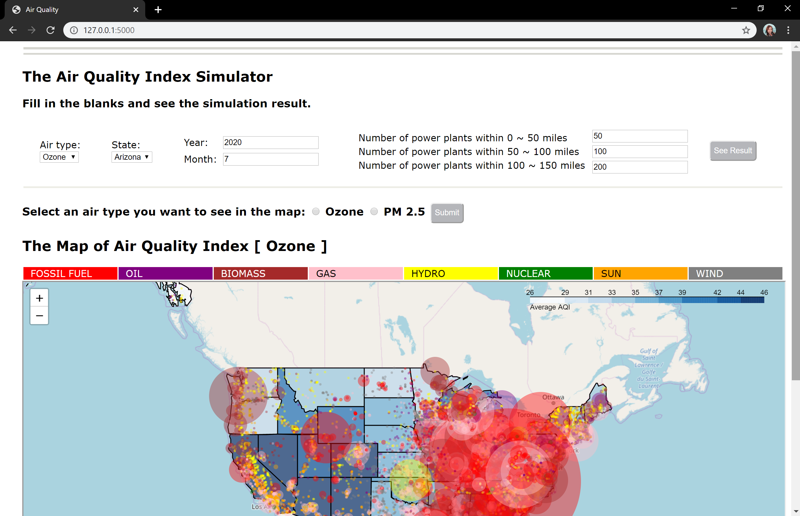
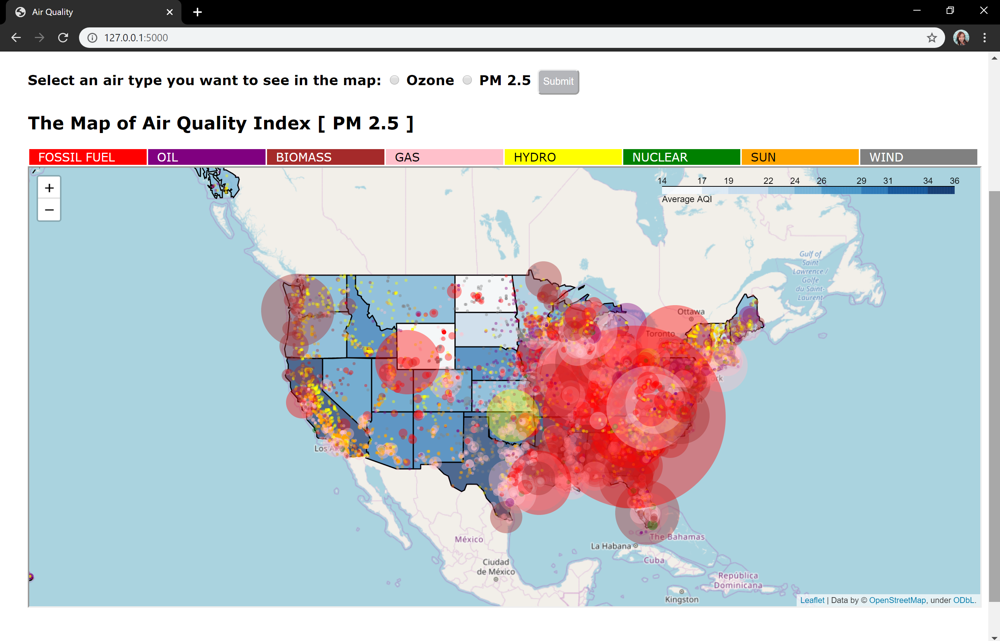
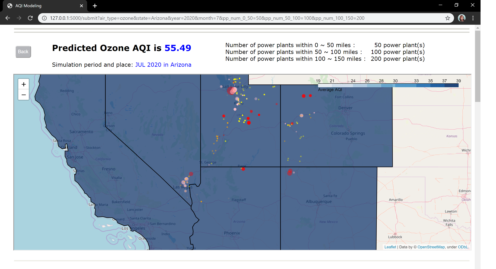
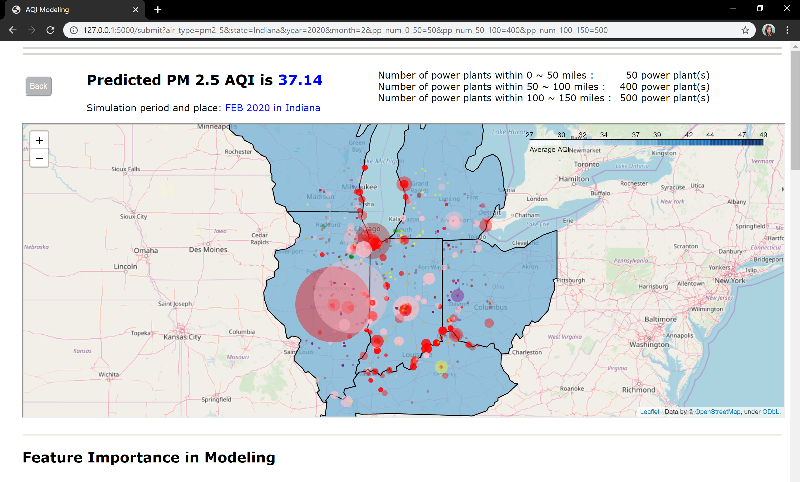
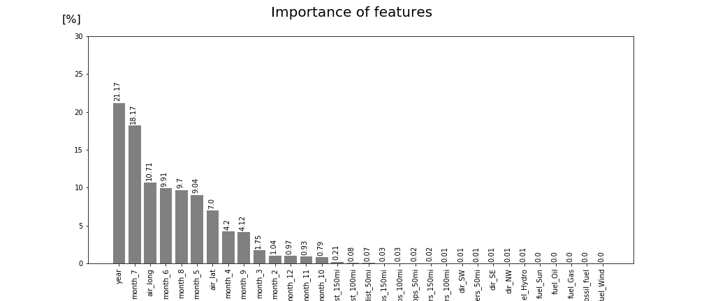
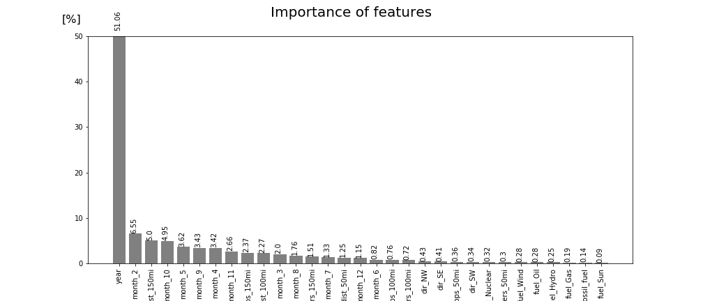
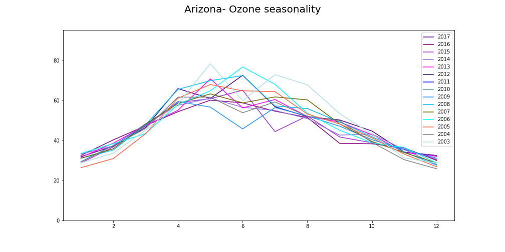
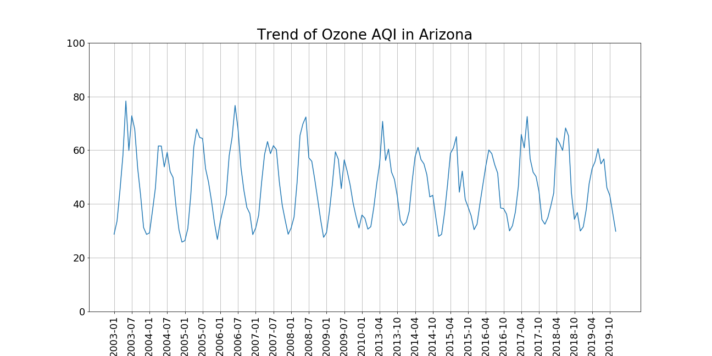
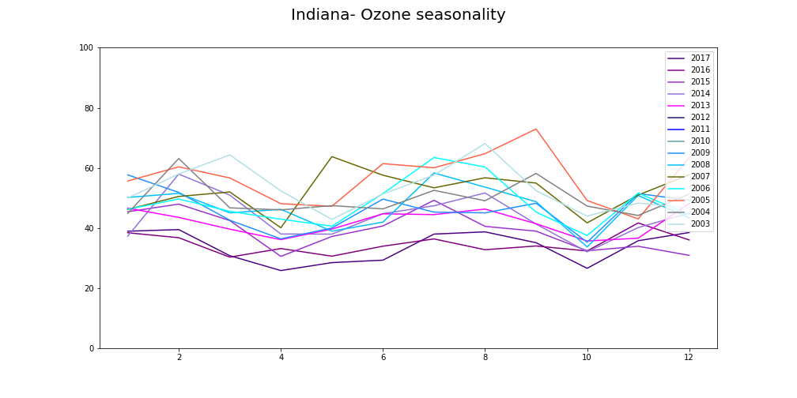
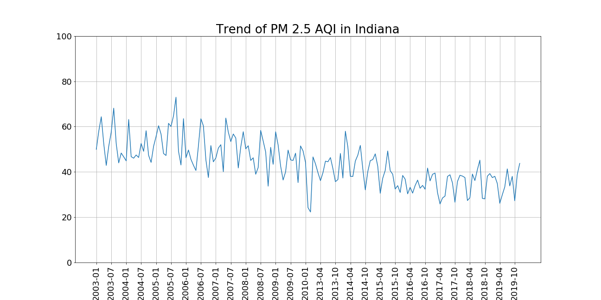

# Air Quality Analysis and Simulation
---

## Table of Contents
- [1 Directory Structure](#1-Directory-Structure)<br>
- [2 Project Outline / Problem Statement](#2-Project-Outline-/-Problem-Statement)<br>
- [3 Description of Data](#3-Description-of-Data)<br>
 -[Size](#Size)<br>
 -[Source](#Source)<br>
 -[Data Dictionary](#Data-Dictionary)<br>
- [4 Data Visualization](#4-Data-Visualization)<br>
- [5 Conclusion](#5-Conclusion)<br>
- [6 Next Steps](#6-Next-Steps)<br>
- [7 Outside Sources](#7-Outside-Sources)<br>


---
## 1 Directory Structure
Only data for simulation is uploaded to this github for the file sizes are reasonable. For the further request, contact me at jjingwow@gmail.com
```
├── project_1
    ├── code
        ├── pickles
            ├── rf_ozone_Arizona_dsi.pickle
            ├── rf_pm2_5_Indiana_dsi.pickle
        ├── EDA_time_series.ipynb
        ├── simul_final.ipynb
    ├── data
        ├── simul
            ├── rf_oz_Arizona_allpp_50.csv
            ├── rf_oz_Arizona_allpp_100.csv
            ├── rf_oz_Arizona_allpp_150.csv
            ├── rf_oz_Arizona_allpp_columns.csv
            ├── rf_pm_Indiana_allpp_50.csv
            ├── rf_pm_Indiana_allpp_100.csv
            ├── rf_pm_Indiana_allpp_150.csv
            ├── rf_pm_Indiana_allpp_columns.csv
        ├── aqi_51state_2003_2019.csv
        ├── ozone_pp_Arizona_mth_allpp_.csv
        ├── pm2_5_pp_Indiana_mth_allpp.csv
        ├── pp_clean.csv
        ├── registered_vehicles.csv
    ├── static
        ├── css
            ├── main.css
        ├── feature_importance_ozone_Arizona_allpp_dist.png
        ├── feature_importance_pm2_5_Indiana_allpp_dist.png
        ├── ozone_seasonality_stack_Arizona.png
        ├── ozone_trend_Arizona.png
        ├── pm2_5_seasonality_stack_Indiana.png
        ├── pm2_5_trend_Indiana.png    
    ├── templates
        ├── form.html
        ├── map_pp_oz_aqi_2016_allpp.html
        ├── map_pp_pm2_5_aqi_2016_allpp.html
        ├── map_simulation.html
        ├── results.html
        ├── simul_map_oz_aqi_2016.html
    ├── simulation
        ├── simulation.py
    ├── Air_quality.pdf
    ├── README.md
    └── app_starter.py
```
---
## 2 Project Outline / Problem Statement

Air is one of the essential things in our lives. The US EPA(Environmental Protection Agency) has fought for a long time for better air quality. In this project, we see the evidence. This analysis shows how the air quality of the states has been changed. With the air quality data, the simulator also shows how the air quality will be changed according to the input factors. Especially in this phase 1, the focus is on Ozone in Arizona and PM2.5 (particulate matter 2.5 micrometers or less) in Indiana. For the modeling, Random Forest recorded the best score: 0.9998. To build the simulator, libraries like Flask, folium, pickle, geopandas, Polygon were specially used.

---
## 3 Description of Data

### Size
- 4.45 GB

### Source
- Air quality data : https://aqs.epa.gov/aqsweb/documents/data_api.html
- Number of registered cars : https://www.fhwa.dot.gov/policyinformation/quickfinddata/qfvehicles.cfm
- Power plant data: https://www.epa.gov/energy/emissions-generation-resource-integrated-database-egrid

### Data Dictionary
Only data for simulation is uploaded to this github for the file sizes are reasonable. For the further request, contact me at jjingwow@gmail.com

|Dataset|Feature|Type|Description|
|---|---|---|---|
| aqi_51state_2003_2019.csv<br> ozone_pp_Arizona_mth_allpp_.csv<br> pm2_5_pp_Indiana_mth_allpp.csv | date | object | date of measurement |
| aqi_51state_2003_2019.csv<br> ozone_pp_Arizona_mth_allpp_.csv<br> pm2_5_pp_Indiana_mth_allpp.csv | air_lat | float64 | latitude of measurement point |
| aqi_51state_2003_2019.csv<br> ozone_pp_Arizona_mth_allpp_.csv<br> pm2_5_pp_Indiana_mth_allpp.csv | air_long | float64 | longitude of measurement point |
| aqi_51state_2003_2019.csv<br> ozone_pp_Arizona_mth_allpp_.csv<br> pm2_5_pp_Indiana_mth_allpp.csv | air_type | object | air type |
| aqi_51state_2003_2019.csv<br> ozone_pp_Arizona_mth_allpp_.csv<br> pm2_5_pp_Indiana_mth_allpp.csv | aqi | int| air quality index |
| aqi_51state_2003_2019.csv<br> ozone_pp_Arizona_mth_allpp_.csv<br> pm2_5_pp_Indiana_mth_allpp.csv | pp_lat | float64 | latitude of power plant |
| aqi_51state_2003_2019.csv<br> ozone_pp_Arizona_mth_allpp_.csv<br> pm2_5_pp_Indiana_mth_allpp.csv | pp_long | float64 | longitude of power plant |
| aqi_51state_2003_2019.csv<br> ozone_pp_Arizona_mth_allpp_.csv<br> pm2_5_pp_Indiana_mth_allpp.csv | pp_boiler | int | number of boilers |
| aqi_51state_2003_2019.csv<br> ozone_pp_Arizona_mth_allpp_.csv<br> pm2_5_pp_Indiana_mth_allpp.csv | fuel | object | type of fuel |
| aqi_51state_2003_2019.csv<br> ozone_pp_Arizona_mth_allpp_.csv<br> pm2_5_pp_Indiana_mth_allpp.csv | distance | float64 | distance from measuring point to power plant |
| aqi_51state_2003_2019.csv<br> ozone_pp_Arizona_mth_allpp_.csv<br> pm2_5_pp_Indiana_mth_allpp.csv | dir | object | direction from measuring point to power plant |
| aqi_51state_2003_2019.csv<br> ozone_pp_Arizona_mth_allpp_.csv<br> pm2_5_pp_Indiana_mth_allpp.csv | state | object | state of power plant |
| aqi_51state_2003_2019.csv<br> ozone_pp_Arizona_mth_allpp_.csv<br> pm2_5_pp_Indiana_mth_allpp.csv | year | int | measured year |
| aqi_51state_2003_2019.csv<br> ozone_pp_Arizona_mth_allpp_.csv<br> pm2_5_pp_Indiana_mth_allpp.csv | month | int | measured month |  
|---|---|---|---|
| pp_clean.csv | year | int| year |
| pp_clean.csv | name | object| name of the power plant |
| pp_clean.csv | lat | float64 | latitude of the power plant |
| pp_clean.csv | long | float64 | longitude of the power plant |
| pp_clean.csv | boiler | int | number of boilers |
| pp_clean.csv | num_gen | int | number of generators |
| pp_clean.csv | state | object | state |
| pp_clean.csv | fuel | object | fuel tyep |
|---|---|---|---|
| registered_vehicles.csv | year | int | registered year |
| registered_vehicles.csv | state | object | registered state |
| registered_vehicles.csv | automobile | int | number of automobiles |
| registered_vehicles.csv | bus | int | number of buses |
| registered_vehicles.2.csv | truck	|	int	| number of trucks |
| registered_vehicles.2.csv | motorcycle	|	 int	| number of motorcycles |
| registered_vehicles.2.csv | all_mv	|	 int	| number of moving vehicles |

---

## 4 Data Visualization
#### Simulator





#### Graphs







---
## 5 Conclusion

- It took more than 40 years of endeavor for the States to make people breathe healthier air. It should've saved a lot of early death. Watching it over and taking care of it not to get worse again is important thing.

---
### 6 Next Steps

- Expand the scope to all states
- In simulation result, add guideline for AQI application
- Do more researches
- Upload simulator to AWS
- Try ‘django’ instead of ‘Flask’

---
## 7 Outside Sources

- AQI data: https://aqs.epa.gov/aqsweb/documents/data_api.html
- Air quality index and explanation : https://airnow.gov/index.cfm?action=aqi_brochure.index
- Population data: https://www.census.gov/data/tables/time-series/demo/popest/2010s-state-total.html
- Number of registered cars : https://www.fhwa.dot.gov/policyinformation/quickfinddata/qfvehicles.cfm
- Lung cancer data: https://wonder.cdc.gov/cancer-v2016.HTML
- Power plant data: https://www.epa.gov/energy/emissions-generation-resource-integrated-database-egrid
- The clean air act(news article): https://www.ucsusa.org/resources/clean-air-act
- The result of the air clean act: https://https://www.epa.gov/clean-air-act-overview/progress-cleaning-air-and-improving-peoples-health
- An example of the execution of the air clean act(news article): https://kutv.com/news/local/utah-court-hits-discovery-channels-diesel-brothers-with-850k-air-pollution-penalty


```

```
